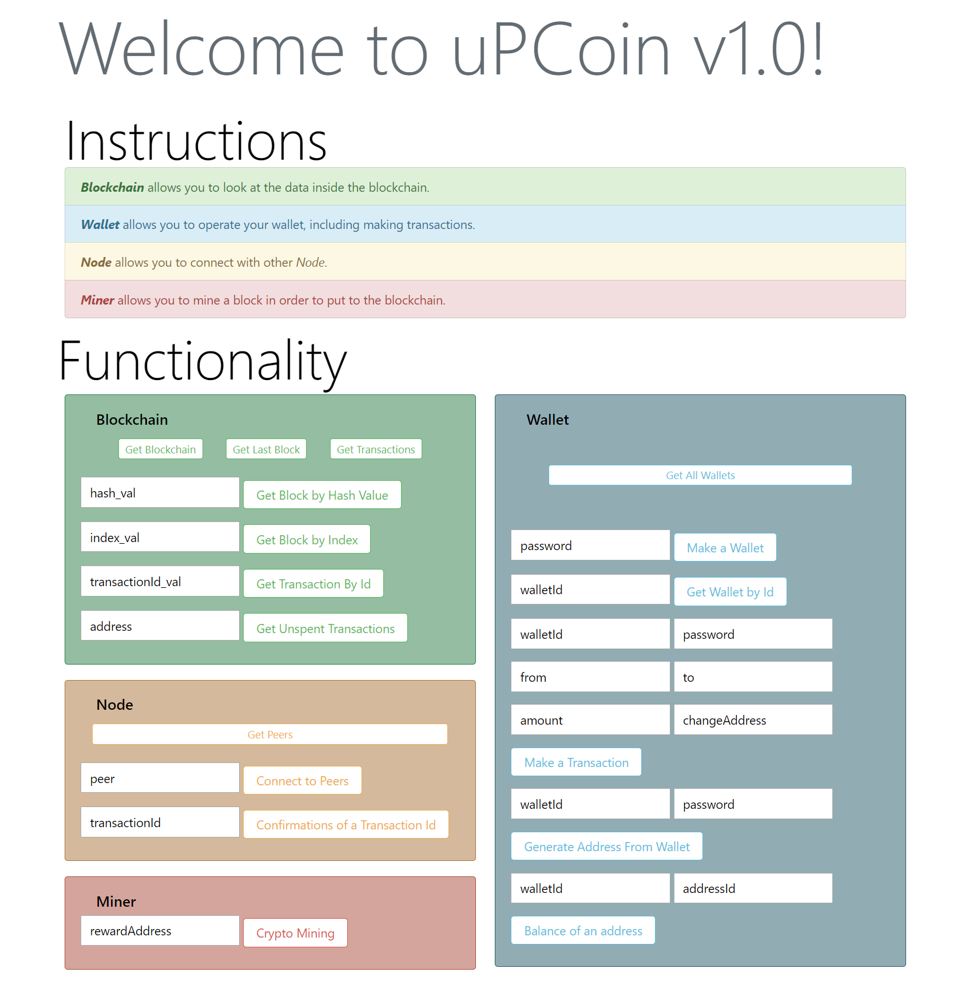

# MicroPCoin

An implementation of a cryptocurrency protocol based on the Bitcoin Protocol.

## Getting Started

Cryptocurrency, such as Bitcoin, has generated a lot of attention in the recent years. The underlying technology has the potential to disrupt the global economy, though most people still do not have a full understanding of the technology behind it. We have decided to implement a simplified version of the Bitcoin protocol to demonstrate how people can transact digital currency. The blockchain technology behind the Bitcoin protocol and other cryptocurrencies requires lots of intensive computation, which is used for reaching consensus through a peer-to-peer network adhering to a protocol for validating new blocks. To account for intensive computations related to blockchain technology, we will demonstrate the utility of FPGAs in accelerating computations.

We will create a prototype system, composed of 2 users in the same network to demonstrate the core functionality of the Bitcoin protocol such as making transactions and generating coins (commonly known as Bitcoin mining). Specifically, two sets of a Raspberry Pi and an FPGA are used to represent two users in the network. The two sets can make transactions and perform proof-of-work (mining process). Another Raspberry Pi will be used to show the list of transactions in the network by displaying blockchain results on a monitor. Note that this last Raspberry Pi does not participate in any transactions making but focuses on illustrating the functionality of our prototype system, so it will be referred to as an observer. 

### Hardware Used

- [MuddPi Mark IV Board](http://pages.hmc.edu/harris/class/e155/E155BoardSchematic2.pdf) 
- [Raspberry Pi Model 3B](https://www.raspberrypi.org/documentation/hardware/raspberrypi/schematics/Raspberry-Pi-3B-V1.2-Schematics.pdf)

## Design

Short:
- FPGA handles proof-of-work and finds hash with SHA-256. it also finds the nonce  
- Raspberry Pi handles the API, moving data around for P2P connectivity through HTTP requests

## Milestones

- [x] Raspberry Pi  
  - [x] HTTP Server, Networking Protocols
  - [x] Miner Operations, Interface to FPGA
  - [x] Node Operations, P2P Network
  - [x] Operator, wallet and addresses setup
  - [x] Blockchain Information transfer
- [x] FPGA  
  - [x] Miner, SHA-Algorithm Implementation
  - [x] Blockchain Verification

## Front End

## Papers
See the following for more information!

- [Proposal](papers/proposal.pdf)
- [Mid-Term Report](papers/midreport.pdf)
- [Final Paper](papers/finalreport.pdf)

## Built With

* [SystemVerilog](http://ieeexplore.ieee.org/document/6469140/) - The language used for the SHA-Algorithm to implement a hardware accelerator.
* [Python 3.6](https://www.python.org/) - HTTP Server Setup with Flask for API endpoints.
* C - Interfacing between Pi and FPGA.

## License

This project is licensed under the MIT License - see the [LICENSE](LICENSE) file for details

## Acknowledgments

* [Bitcoin Protocol](https://bitcoin.org/bitcoin.pd://bitcoin.org/bitcoin.pdf) - The Original Satoshi Nakomoto Paper
* [SHA-Algorithm](https://csrc.nist.gov/csrc/media/publications/fips/180/4/final/documents/fips180-4-draft-aug2014.pdf) - The implementation of the Cryptocurrency Protocol
* [Mastering Bitcoin](https://github.com/bitcoinbook/bitcoinbook) - Descriptions of the Bitcoin Protocol
* [Reference Implementation](https://github.com/conradoqg/naivecoin) - Cryptocurrency Implementation in Node.js in 1500 lines
